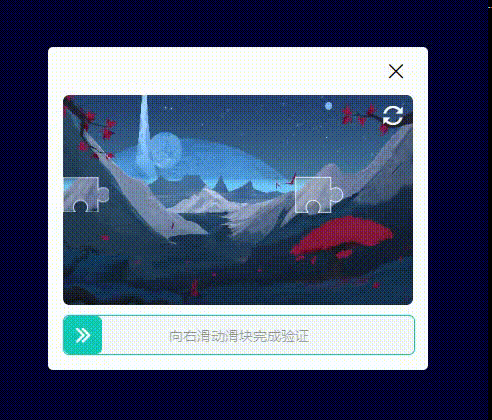

# 滑块验证码

滑块验证码是人类行为校验的一种，在当前需要登录的场景使用是相当频繁的。
## 演示示例

[演示地址](http://121.5.230.70:8080/captcha-slider/)



## 特色功能：

* 支持开发者获取鼠标（手指）运动轨迹、时间、精准度等信息；用户后台验证
* 支持对**pc端**和**移动端**使用
* 支持`commonjs`、`esmoudle`和`cdn`的方式引入
* 使用简单、傻瓜式操作

## 快速开始

### 安装

```shell	
npm install captcha-slider --save
```

### 引入

```js
import CaptchaSlider from 'captcha-slider'

```
> 提示： 也支持`<script src="captchaSlider.iife.js"></script>` 的方式引入


### 用法

添加`html`容器

> 注意： 容器需要设置宽度，容器的宽度作为**滑块验证码**的宽度

```html
<div class="captcha-slider" style="width: 360px;"></div>
```

### 创建控件

```js
new CaptchaSlider({
    el: '.slider-captcha',
    onSuccess () {
        console.log('成功')
    },
    onFail () {
        console.log('失败')
    },
    onChange (rate, event) {
        console.log(rate, event)
    }
})
```


## 配置项

| 名称                | 类型              | 默认值 | 必传 | 说明                                                         |
| ------------------- | ----------------- | ------ | ---- | ------------------------------------------------------------ |
| `el`                | string \| element | 无     | 是   | 控件容器                                                     |
| `vailadeValue`        | number            | 5      | 否   | 验证容错偏差值 默认5个像素偏差即认为验证通过                 |
| `picList`             | string[]          |        | 否   | 图片路径地址数组                                             |
| `showReload`          | bookean           | true   | 否   | 是否显示右上角的额重新加载按钮                               |
| `slideSizeRate`       | number            | 0.1    | 否   | 滑块尺寸比率： 滑块实际尺寸 = 容器width * slideSizeRate      |
| `vaildResultShowTime` | number            | 1500   | 否   | 验证结果展示事件 默认1500ms （单位ms）                       |
| `onSuccess`           | function          | 无     | 否   | 验证成功时回调 （参数1：横向移动百分比）                     |
| `onFail`              | function          | 无     | 否   | 验证失败时回调（参数1：横向移动百分比）                      |
| `onStart`             | function          | 无     | 否   | 开始点击滑块时的回调（参数1：`mousedown`/`touchstart`事件`event`） |
| `onChange`            | function          | 无     | 否   | 滑块滑动时的回调 (参数1： 横向移动百分比， 参数2：`mousemove`/`touchmove`事件`event`) |
| `onEnd`               | function          | 无     | 否   | 滑块结束滑动时的回调 (参数1： 横向移动百分比， 参数2：`mouseup`/`touchend`事件`event`) |

## 方法

| 方法名        | 返回值 | 示例                    | 描述                   |
| ------------- | ------ | ----------------------- | ---------------------- |
| `reset`         | 无     | `captcha.reset()`         | 重置控件               |
| `loadNextImage` | 无     | `captcha.loadNextImage()` | 使用下一个图片绘制控件 |
| `destory`       | 无     | `captcha.destory()`       | 销毁控件               |

